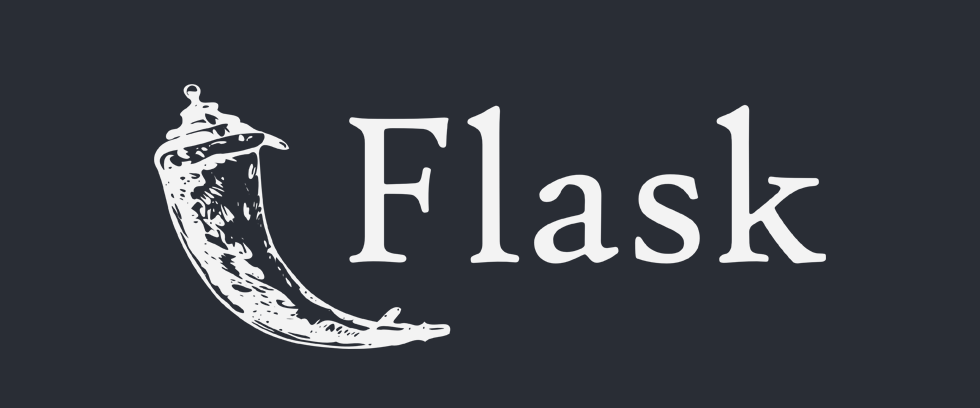
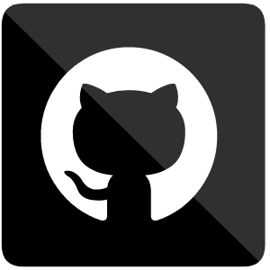

<h1 align="Center"> Hi there, I'm Sijal - aka CJ 👋 </h1>

 

### Connect with me:

[][linkedin]
[][instagram]
[][tableau]

 

## I'm Junior Data Scientist, Developer, and Entreprenure!!

- 🌱 I’m currently learning everything 🤣
- 👯 I’m looking to collaborate with other Developers.
- 🥅 2021 Goals: Contribute more to AI Projects
- ⚡ Fun fact: I love to play basketball and sketch.

 

### Languages and Tools:

 
 

 
 

---
<!--

[][linkedin]

-->
 

:zap: GitHub Activity

  
<!--START_SECTION:activity-->

&nbsp; &nbsp; 1. &#128479; [NLP Summarization](https://github.com/sijal001/NLP_Summarization)  
&nbsp; &nbsp; 2. &#127969; [3D House using location](https://github.com/sijal001/3D-House-Project)  
&nbsp; &nbsp; 3. &#128266; [Malfunctioning Machine Investigation and Inspection Using Sound](https://github.com/sijal001/Malfunctioning_Industrial_Machine_Investigation_and_Inspection_Using_Sound)  
&nbsp; &nbsp; 4. &#128270; [Web Scrapying](https://github.com/sijal001/Web_scraping_RealEstate_Information)  
&nbsp; &nbsp; 5. &#x1F3CB; [Yoga Pose Detection](https://github.com/sijal001/Yoga_Pose_Detection)  
&nbsp; &nbsp; 6. &#x2700; [Image Background Removal](https://github.com/sijal001/Remove_Image_Background)  

<!--END_SECTION:activity-->

 

 &#x1f4c8; GitHub Stats

<!--

-->

[instagram]: https://www.instagram.com/oasis.sijal__/
[linkedin]: https://www.linkedin.com/in/sijal-kumar-joshi-b1545584/
[tableau]: https://public.tableau.com/profile/sijal3730#!/
